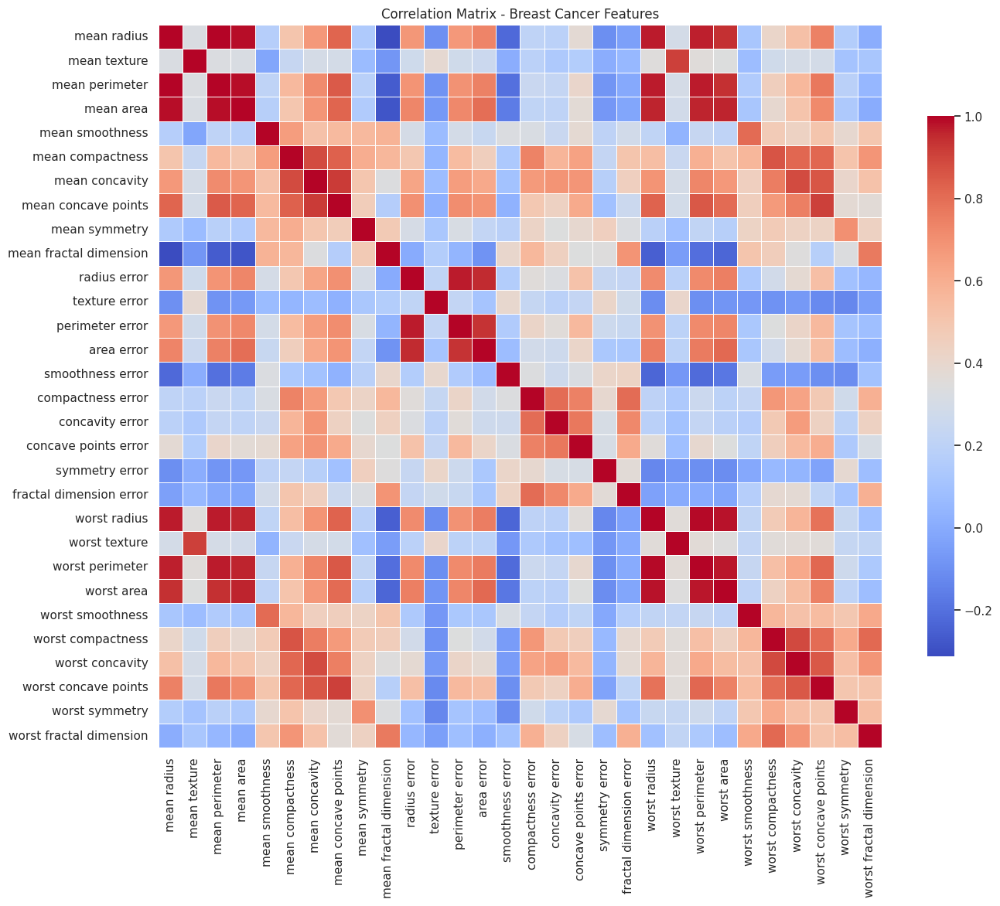

# Assignment 2 Outputs
##  (Breast Cancer Wisconsin - Logistic regression, KNN, Decision tree ,SVC)

## Problem Statement
Pickup any dataset from scikit-learn like Breast cancer Wisconsin (diagnostic) dataset and solve the problem of binary classification.  
- a. Apply data pre-processing. Display all the data fields and the subset being used.  
- b. Show the results with different methods
  - i. Logistic regression  
  - ii. KNN   
  - iii. Decision tree  
  - iv. SVC
- c. Evaluate using different measures. Make sure the final result is having the least error.  
- d. Visualize the results using matplotlib/ seaborn. Show correlation matrix.  

## Dataset Shape and Target Classes
  
Observation: Confirms 569 samples, 30 features, and binary target mapping (malignant = 0, benign = 1).

---

## List of All Feature Names
  
Observation: Shows all 30 input features and the target class names.

---

## Subset of Selected Features
  
Observation: Displays initial rows of the selected eight features used in the models.

---

## Logistic Regression Report & Confusion Matrix
  
Observation: Logistic Regression shows the best performance with highest accuracy and F1-score.

---

## KNN Report & Confusion Matrix
  
Observation: KNN performs very close to Logistic Regression with strong precision/recall.

---

## Decision Tree Report & Confusion Matrix
  
Observation: Decision Tree has slightly lower accuracy, misclassifying more benign samples.

---

## SVC (RBF) Report & Confusion Matrix
  
Observation: SVC achieves high balanced metrics with minimal misclassification.

---

## Summary Metrics Table
  
Observation: Metrics table clearly shows Logistic Regression as the best-performing model.

---

## Model Comparison Bar Chart
  
Observation: Models compared visually across accuracy, precision, recall and F1-score.

---

## Correlation_Matrix.png – Correlation Matrix of All Features
  
Observation: Strong correlations observed among radius, perimeter, and area-based features.
