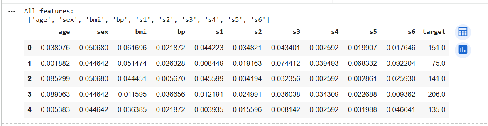
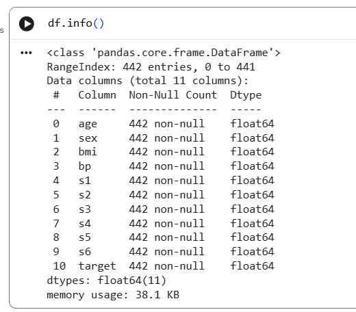
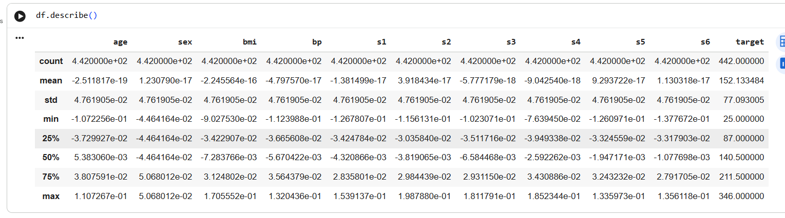
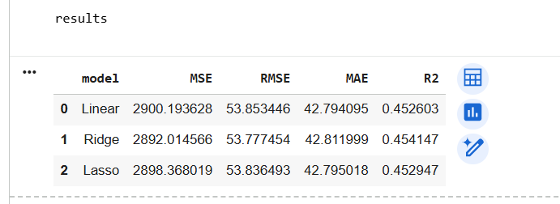
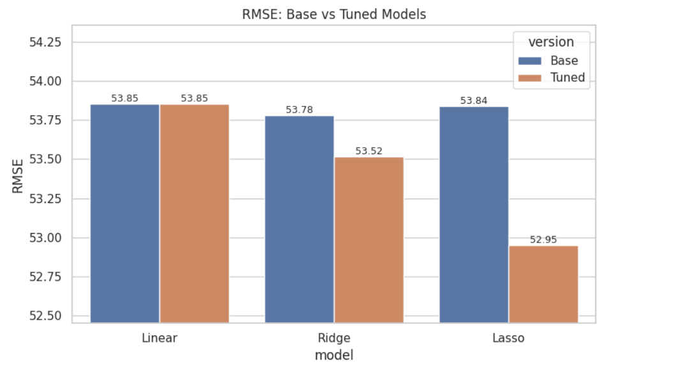

# Diabetes Regression – Model Outputs

## 1. All Features in the Dataset
_All input feature names (age, sex, bmi, bp, s1–s6) and the target column from the diabetes dataset._
  

---

## 2. DataFrame Info
_Structure of the DataFrame showing 442 rows, 10 standardized feature columns, and the target column with no missing values._
  

---

## 3. Descriptive Statistics
_Summary statistics (count, mean, std, min, max, quartiles) for each standardized feature and the target._

  

---

## 4. Base Model Metrics
_Table of performance metrics (MSE, RMSE, MAE, R²) for the base Linear, Ridge, and Lasso regression models._  
  

---

## 5. RMSE Comparison – Base Models
_Bar chart comparing RMSE values of the base Linear, Ridge, and Lasso models (lower RMSE indicates better performance)._
  

---

## 6. Tuned Model Metrics
_Table of performance metrics for the hyperparameter-tuned Linear, Ridge, and Lasso regression models._
  

---

## 7. RMSE – Base vs Tuned Models
_Grouped bar chart comparing RMSE of base vs hyperparameter-tuned models for Linear, Ridge, and Lasso regression._
  

